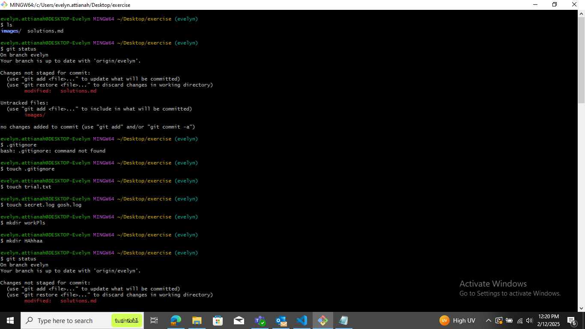
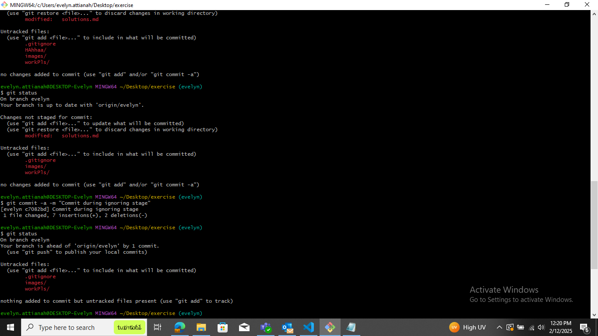

# Solutions to questions 

## Question 1
Git was created by Linus Torvalds.

The essence of git s a distributed version control system (DVCS) designed to handle everything from small to very large projects with speed and efficiency

## Question 2
- Git is a distributed version control system for tracking code changes locally and remotely.  
- GitHub is a cloud-based Git repository hosting service owned by Microsoft, popular for open-source collaboration.  
- GitLab is a Git repository manager with built-in CI/CD and DevOps tools, offering both cloud and self-hosted options.

## Question 3
- ### Distributed Version Control Systems (DVCS)
1. Mercurial (Hg) Similar to Git, known for simplicity and performance.
2. Bazaar Flexible and user-friendly, developed by Canonical (Ubuntu's parent company).
3. Fossil Includes issue tracking and wiki features, used by SQLite.
- ### Centralized Version Control Systems (CVCS)
1. Apache Subversion (SVN) A widely used, older version control system.
2. Perforce (Helix Core) Used in enterprise environments, especially in gaming and large software projects.
3. IBM Rational ClearCase Enterprise-grade, used for large-scale software development.
4. CVS (Concurrent Versions System) One of the earliest VCS, now mostly obsolete.

## Question 4
The git status command shows the current state of your working directory and staging area.

 It helps you see which files have been modified, staged, or remain untracked before committing changes.

 ## Question 5
 In Git, a commit is a fundamental concept that represents a snapshot of your project at a specific point in time. 
 
 When you make a commit, Git saves the state of your project,
 
including all tracked files, and assigns a unique identifier (a commit hash) to this snapshot.

This allows you to track changes, collaborate with other developers, and revert to previous versions if needed.

## Question 6
In Git, you can ignore files by creating a ".gitignore file".

 This prevents Git from tracking specific files or directories, such as logs, temporary files, or sensitive credentials.

## Question 7
**git log** is a command used to view the commit history of a Git repository.
 It shows a chronological list of commits, including details such as commit hashes, author names, timestamps, and commit messages.

## Question 8
**git add** is a command that stages changes in your working directory, preparing them to be committed. It does not save the changes permanently—that happens when you run git commit.

Think of git add as marking files for commit. Without it, changes won't be included in the next commit.

## Question 9
The staging area (also called the index) in Git is a temporary place where changes are stored before they are committed. It allows you to review and group changes before making a commit.

Untracked files: Files that Git doesn’t yet know about.
Tracked files: Files that Git is aware of, including staged and committed files.
Staged files: Files that have been added to the staging area but not yet committed.

Untracked → Tracked: git add <file>
Tracked → Staged: git add <file>
Staged → Committed: git commit -m "message"

## Question 10
To commit in Git with the message on the same line, use the -m flag followed by your commit message in quotes:

**git commit -m "Your commit message here"**

This command stages all currently staged changes and saves them with the provided message.

## Question 11
| Command |	Purpose | Action |
| --- | --- | --- |
| git pull | Updates local branch with the latest changes from a remote repository	Fetches and merges remote changes into your current branch |
| git push | Uploads local commits to the remote repository	Sends local commits to a remote branch |
| git fetch | Retrieves updates from the remote repository without merging	Downloads new commits but doesn’t modify your working branch |

- git fetch only downloads remote changes.
- git pull downloads and merges remote changes.
- git push uploads your local commits to the remote repository.

## Question 12

## Question 13

git merge → Combines branches and keeps history (creates a merge commit).

**git checkout main**

**git merge feature-branch**

git rebase → Moves commits from one branch on top of another (rewrites history, no merge commit).

**git checkout feature-branch**

**git rebase main**

## Question 14
git checkout is a command used to switch between branches or restore files to a previous state.

Alias for git checkout:
The alias for git checkout is git switch (for switching branches) and git restore (for restoring files).

## Question 15
## Question 16
## Question 17
## Question 18
## Question 19
## Question 20